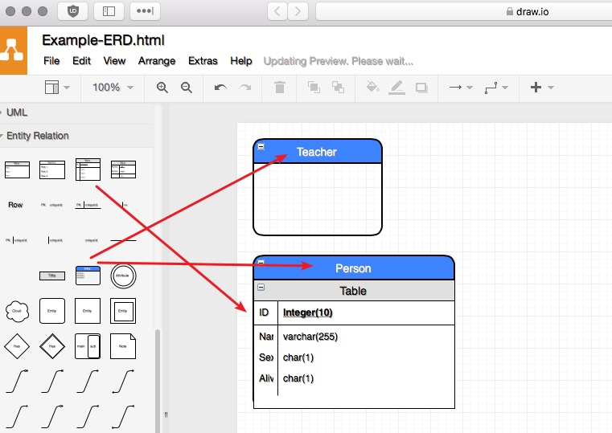

### Info 

| Author | Platform | Link |
| :---: | --- | --- |
| / | visual-paradigm.com | [什么是实体关系图(ERD) ?](https://www.visual-paradigm.com/cn/guide/data-modeling/what-is-entity-relationship-diagram/#erd-data-models) |

-----------------

### 关键概念
- 实体 
- 实体之间的关系 

### ER 的三个层次模型

- 表
    
    | 功能 | 概念 | 逻辑 | 物理 | 
    | :--- | :--: | :--: | :--: | 
    | 实体 | YES | YES | YES | 
    | 关系 | YES | YES | YES | 
    | 列 |  | YES | YES | 
    | 列的类型 |  | WHATEVER | YES | 
    | 主键 / 外键 |  |  | YES | 
    
- 人话
    - 自概念到物理, 抽象层次降低, 各块细节趋向完善。
    - 自抽象层次趋高，细节越多。
        > Customer 
        > > Customer: Name, Gender etc.
        > > > Customer: Name(char), Gender(char)
        
- 相关示例 
    > [电影租赁系统](https://www.visual-paradigm.com/cn/guide/data-modeling/what-is-entity-relationship-diagram/#erd-examples) 以及其他

### 协同
- 还可配合 [数据流图(DFD)](https://www.visual-paradigm.com/cn/guide/data-modeling/what-is-entity-relationship-diagram/#erd-data-flow) 或是 [业务流程图(BPD)](https://www.visual-paradigm.com/cn/guide/data-modeling/what-is-entity-relationship-diagram/#erd-bpd) 等其他类型的图表。

### 在线绘制示例 

- 

